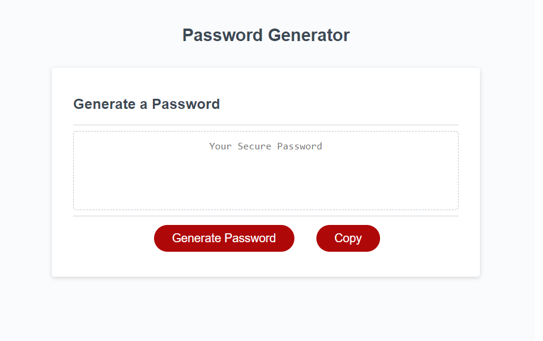

# 02_Passwrod_Generator_NN
BootCamp Homework - 03 JavaScript: Password Generator

## The Challenge
This week's Challenge requires you to modify starter code to create an application that enables employees to generate random passwords based on criteria that they’ve selected. 
This app will run in the browser and will feature dynamically updated HTML and CSS powered by JavaScript code that you write. 
It will have a clean and polished, responsive user interface that adapts to multiple screen sizes.





## User Story

```
AS AN employee with access to sensitive data
I WANT to randomly generate a password that meets certain criteria
SO THAT I can create a strong password that provides greater security
```

## Acceptance Criteria

```
GIVEN I need a new, secure password
WHEN I click the button to generate a password
THEN I am presented with a series of prompts for password criteria
WHEN prompted for password criteria
THEN I select which criteria to include in the password
WHEN prompted for the length of the password
THEN I choose a length of at least 8 characters and no more than 128 characters
WHEN asked for character types to include in the password
THEN I confirm whether or not to include lowercase, uppercase, numeric, and/or special characters
WHEN I answer each prompt
THEN my input should be validated and at least one character type should be selected
WHEN all prompts are answered
THEN a password is generated that matches the selected criteria
WHEN the password is generated
THEN the password is either displayed in an alert or written to the page
``` 

## The Process
To satisfy our client's needs, we had to:
- Create two buttons to generate and copy the password
- Provide descriptive comments for each function in JavaScript file
- Modify HTML file to dynamically work with JavaScript file
- Log input data in the console

Specific functions in JavaScript file

```
Define variables for generate button, copy button, lower case characteres, uppercase characters, special characters, and number characters
Function determining the length of the password
Function determining whether or not to include uppcase characters in the password
Function determining whether or not to include numbers in the password
Function determining whether or not to include special characters in the password
Function generating random password to input
Function for the Generate Password button
Function for the Copy button
```

## The Result
After modifying the JavaSript file, we were able to provide a secure, clean, and fully functional password generator for our client. 

## Submission
This project was uploaded to GitHub at the following respository link:
[https://github.com/nhanng19/challenge03](https://github.com/nhanng19/challenge03)

Depolyed Web Application Link:
[https://nhanng19.github.io/challenge03/develop/index](https://nhanng19.github.io/challenge03/develop/index)
